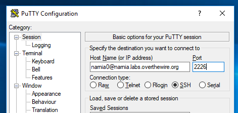
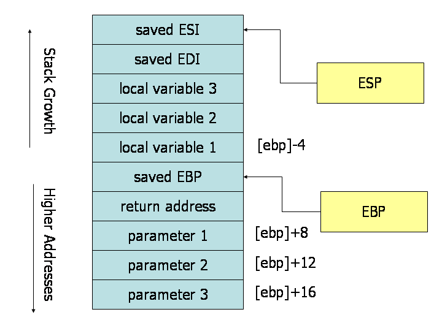

Binary Exploitation Handout
===========================

This document complements the Binary Explotation workshop, containing a
reference of some of the useful commands and concepts used during the workshop.

## Connecting to OverTheWire

On Windows, you will need
[PuTTY](https://www.chiark.greenend.org.uk/~sgtatham/putty/). This software
allows you to establish SSH connections to other computers, in this case a
server hosted by OverTheWire.

We want to connect to `narnia0@narnia.labs.overthewire.org`, port 2226.

On Mac or Linux, SSH is already built in. Open a terminal and run:

    $ ssh -p 2226 narnia0@narnia.labs.overthewire.org

The password in both cases is `narnia0`. For security, you won't get any
characters appearing on the screen while you type the password, but don't worry
it is still being typed!

If you get a warning about "host key verification", click "yes".

When you are connected to OverTheWire, run the following two commands to set up
a directory to use and to copy the workshop files:

    $ cd $(mktemp -d)
    $ git clone /tmp/rm802-workshop

## The x86 Stack

Terminology note: the stack grows with *decreasing* memory addresses, however
we will refer to the "top of the stack" to be the newest item (i.e. the
*lowest* memory address) and the "bottom of the stack" to be the oldest item
(i.e. the *highest* memory address). Also remember that arrays are indexed with
*increasing memory addresses*, so higher array indexes go *lower* in the stack.

Each function call creates a new stack frame, delimited by the `ebp` and `esp`
registers. The `ebp` register is also known as the "frame pointer", and points
to the bottom of the current stack frame, and the `esp` register is also known
as the "stack pointer" and points to the top of the stack.

When a function is called, the return address (from the caller) is stored
immediately below the new stack frame, i.e. just below `ebp`. With the stack
memory layout, this means the return address is at `ebp + 4`.

## Usage of gdb

To start gdb on a program, say `./00-addition`, run:

    $ gdb ./00-addition

We use PEDA to enhance gdb:

    (gdb) source /usr/local/peda/peda.py

A few handy commands:

* `(gdb) run [args]`: Run the program with some arguments
* `(gdb) pdisas <function>`: Disassemble a function
* `(gdb) context`: View the current registers/code/stack
* `(gdb) break <function>`: Set a breakpoint on a given function
* `(gdb) delete breakpoint <n>`: Delete breakpoint n
* `(gdb) set *0xdeadbeef = 0x12345678`: Set the memory address `0xdeadbeef` to
  `0x12345678`

## Narnia Wargame

See https://overthewire.org/wargames/narnia/ for more details.

We want to extract the password for the next level in `/etc/narnia_pass/`.

We can execute our current level's program in `/narnia/`, which are accompanied
by the C source code used to build them.

## Tips and Tricks

When trying to "type" special characters (e.g. for shellcode), use Python:

    python -c 'print("\xde\xad\xbe\xef" + "a"*42)'

Use with a subshell to pass arguments to a program:

    $ ./program $(python ...)

When you need an interactive shell, but also need to pipe special characters
into a program, use:

    $ (python ...; cat) | ./program

Check out this great shellcode resource: http://shell-storm.org/shellcode/
